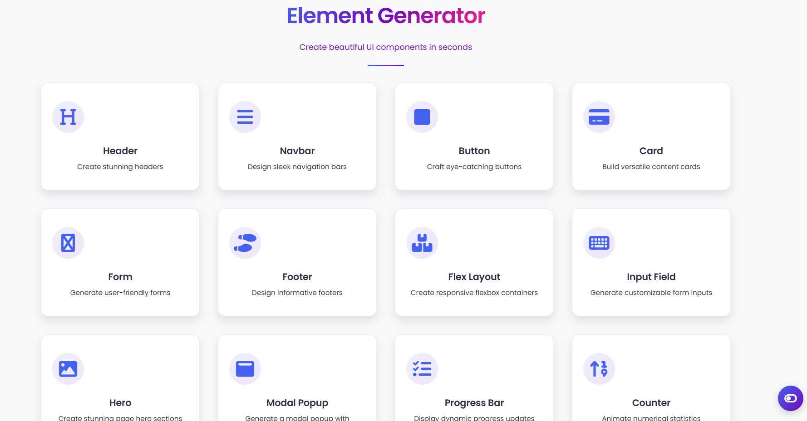

# 💻🎨 HTML & CSS Generator

### ⚡ Create Beautiful UI Components in Seconds

Tired of rewriting the same HTML/CSS for every project? **HTML & CSS Generator** is your go-to tool for instantly generating **clean, responsive, and customizable UI components**—so you can focus on building great websites.

## ✨ Features

Generate ready-to-use code for:

- **Headers** (Header level, Hover effects)
- **Navbars** (Responsive, Sticky)
- **Buttons** (Hover Color, Shadows, Icon Buttons)
- **Footers** (Copyright, Minimalist)
- **Forms** (Textarea, Email)
- **Cards** (Profile, Product, Blog Cards)
- **Flex Layouts** (Flexbox Templates)
- **Input Fields** (Labels, Placeholders, Help texts)
- **Hero Sections** (Main page, Layout style, Animation, Dark overlay)
- **Modal Popup** (Animated, Popup, Focus)
- **Progress Bar** (Animated, Gradient, Smooth Transition)
- **Counter** (Incremental, Animated)

## 🛠️ Built With

- **HTML5**
- **CSS3**
- **JavaScript**
- **Libraries**:

  - Typed.js for text animations
  - Font Awesome for icons

## 👥 Contributors

- [Mohammed Darras](https://github.com/darrasHumber)
- [Muhammad Hashim Ali](https://github.com/Hashim271)
- [Farhad Asgari Hasan Vand](https://github.com/f-vand)

---

## [Live Demo](https://darrashumber.github.io/html-css-generator/)

## Project Demo

[Watch The Video](https://www.youtube.com/watch?v=IeAq48NwnbM)
